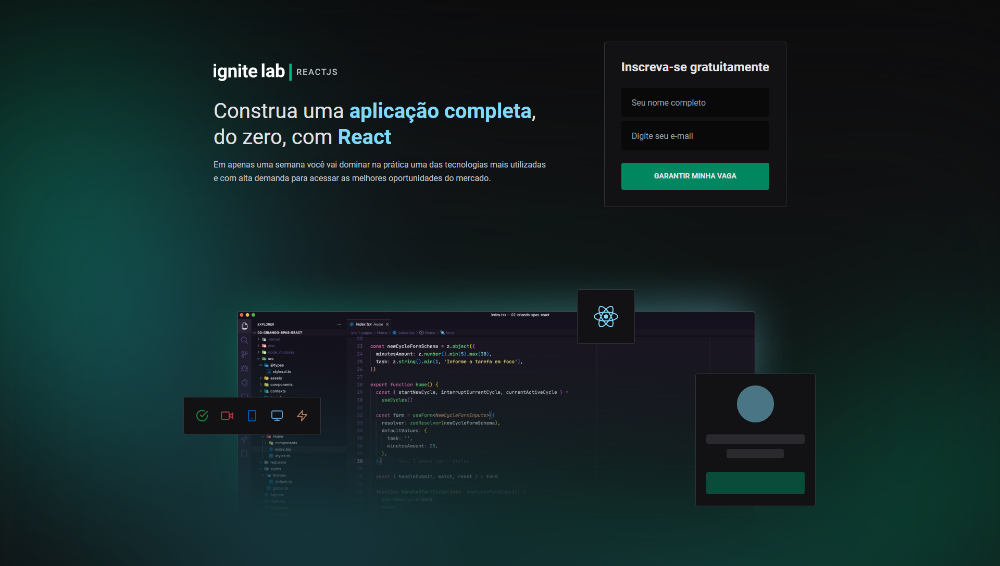
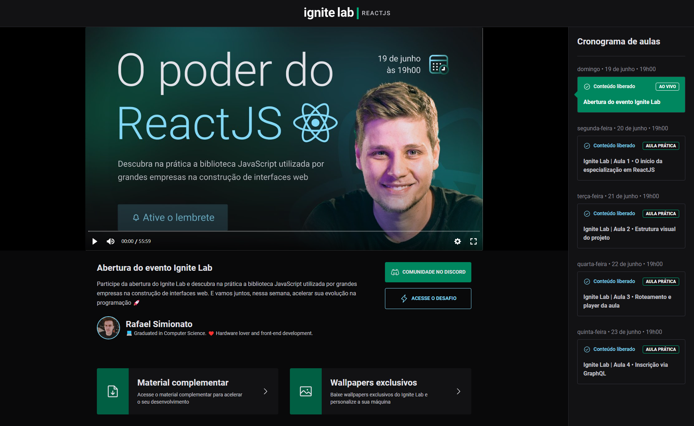

<p align='center'></p>
<h1 align='center'>Plataforma | Ignite Lab</h1>
<p align='center'>


</p>

## 🔖 Descrição
<p>👨‍💻 Criação de uma plataforma de vídeos crida no Ignite Lab disponibilizada pela Rocketseat.<p>

## ⚙️ Funcionalidades
- Criar uma subscrição para acessar as aulas
- Navegar pela plataforma selecionando as aulas desejadas

## 🚀 Tecnologias
Esse projeto está utilizando as seguintes tecnologias:
- HTML
- CSS
- JavaScript
- [React](https://vitejs.dev/)
- [Typescript](https://www.typescriptlang.org/)
- [GraphCMS](https://graphcms.com/)
- [GraphQL](https://graphql.org/)


## 🎲 Como utilizar
### Clone esse repositório
```bash
git clone https://github.com/rafaasimi/ignitelab-rocketseat.git
```
### Navegue até o diretório
```bash
cd ignitelab-rocketseat
```
### Instale as dependências
```bash
npm i
```
```bash
yarn
```
### Inicie a aplicação
```bash
yarn dev
```


## 🖼️ Layout



---
<p>Criado com 💙 por <a href='https://github.com/rafaasimi/' target='_blank'>Rafael Simionato</a></p>